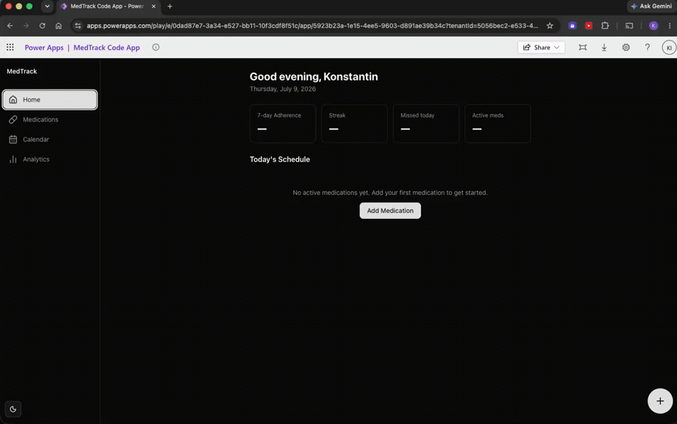

# MedTrack

> A medication adherence tracker that proves the Power Platform can be treated as a real engineering target — not just a low-code escape hatch.



MedTrack is a **React 19 + TypeScript Power Apps Code App** backed by **Microsoft Dataverse**. It lets users manage their medication schedules, log every dose outcome, and review adherence trends over time — with a pipeline that ships the whole thing without anyone touching a terminal.

---

## What it does

| Screen | Capability |
|---|---|
| **Dashboard** | Overdue reminders, today's schedule, adherence %, current streak |
| **Log Intake** | Segmented Taken / Skipped / Missed control; interactive body map for injection sites |
| **Calendar** | Month view with colour-coded dose history; tap any day to log or edit |
| **Analytics** | Adherence trend charts across 3-month, 6-month, and 1-year windows; CSV export |
| **Medications** | Add, edit, deactivate, and archive medications; Active / Inactive grouping |

**Adherence is computed from first principles** — `Taken ÷ non-Skipped`. *Skipped* is deliberately neutral: a clinical choice that doesn't count for or against the user. That's an [Architecture Decision Record](docs/adr/0001-skipped-doses-neutral.md), not an accident.

---

## Architecture

### The stack

- **Frontend**: React 19, TypeScript 5 (strict), Vite 7, React Router 7, TanStack Query 5, Zustand 5
- **UI**: shadcn/ui + Radix UI primitives, Tailwind CSS 4, Recharts, Lucide React
- **Backend**: Microsoft Dataverse — two tables (`ppa_medication`, `ppa_intakelog`) with a source-controlled schema deployed as a Dataverse solution
- **Platform**: Power Apps Code App (`@microsoft/power-apps` 1.1) — the host manages auth; the app never touches credentials

### Design decisions that matter

**A typed seam between the app and Dataverse.** All data access is funnelled through generated service classes in `src/generated/`. No component ever calls Dataverse directly. This is a deep module behind a small interface — easy to mock, easy to swap, impossible to accidentally bypass.

**Server state and UI state are separated by design.** TanStack Query owns server state (medications, intake logs). Zustand owns ephemeral UI state (open dialogs, selected dates, draft forms). They never bleed into each other.

**The domain language is pinned before any code is written.** [`CONTEXT.md`](CONTEXT.md) is the living glossary every developer and AI agent reads first. *Skipped ≠ Missed* is a single distinction that prevents hours of debugging.

---

## AI-assisted workflow

This project was built using **Spec Kit** — a structured AI-assisted workflow that keeps every decision traceable from natural-language idea to running code.

```
/grill-with-docs → spec.md → plan.md → tasks.md → /implement (per ticket)
```

Every feature lives in `specs/`:

- **`spec.md`** — the contract: user stories, clarification Q&A, and acceptance scenarios. Every ambiguity resolved *before* implementation starts.
- **`plan.md`** — technical decisions: stack choices, constraints, architecture, delivery order.
- **`tasks.md`** — atomic, dependency-ordered implementation tickets. Each one starts a fresh AI context window.

The workflow keeps the engineer in control of the decisions while the AI handles implementation throughput. Every decision is auditable because it's in a file — not buried in a chat log.

Feature [`003-github-actions-cicd`](specs/003-github-actions-cicd/) follows the same spec-to-pipeline pattern. Even the CI/CD is a feature, not an afterthought.

---

## CI/CD — nothing ships from a laptop

All four workflows live in [`.github/workflows/`](.github/workflows/). Credentials are never committed — environment identifiers and secrets are injected at runtime via GitHub Environments.

### The pipeline

```
Pull Request
  └── ci.yml ──► install → lint → type-check → build → test → secret scan → workflow lint
                  All must pass. Target: < 10 minutes with npm caching.

Merge to main
  └── deploy-dev.yml ──► pack Dataverse solution → import schema → push app → dev environment
                          Schema always lands before the app. They never drift.

Manual promotion
  └── promote-prod.yml ──► required reviewer approval → same deploy job → production
                            No code reaches production without a human sign-off.
```

### Security posture

- **[Gitleaks](https://github.com/gitleaks/gitleaks)** runs on every PR — any committed secret blocks the merge
- **[Actionlint](https://github.com/rhysd/actionlint)** validates all workflow YAML in CI
- **Git history was rewritten** before the repo went public: a committed private key and hardcoded environment identifiers were purged and rotated (`scripts/security/history-purge-runbook.md`)
- **`power.config.json` is never committed** — `power.config.template.json` + `scripts/ci/render-power-config.ps1` inject the real values from secrets at build time
- Production deploys and destructive data ops are behind a **manual approval gate** — no automation can push to prod unsupervised

---

## Project structure

```
src/
├── components/         # UI components (dashboard, calendar, analytics, medications, intake)
├── generated/          # Auto-generated Dataverse service layer (the only data access path)
├── hooks/              # TanStack Query hooks (use-medications, use-intake-logs, use-adherence…)
├── lib/                # Pure domain logic (adherence.ts, date-utils.ts, injection-sites.ts…)
├── pages/              # Route-level page components
├── stores/             # Zustand UI state (log-intake-store, ui-store)
└── mocks/              # MSW mock service layer for testing

specs/                  # Spec Kit artifacts — the paper trail for every feature
docs/adr/               # Architecture Decision Records
solution/               # Dataverse schema as an unpacked, source-controlled solution
.github/workflows/      # CI/CD pipeline
```

---

## Running locally

```bash
npm install
npm run dev
```

Tests:

```bash
npm run test
```

CI build (matches the pipeline exactly — no deploy side-effects):

```bash
npm run build:ci
```
