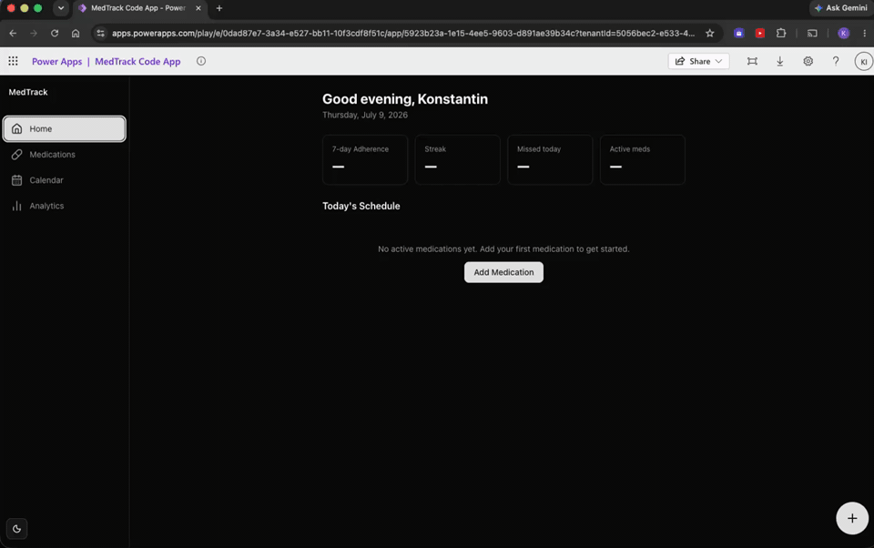

# MedTrack

> A medication adherence tracker that proves the Power Platform can be treated as a real engineering target — not just a low-code escape hatch.



MedTrack is a **React 19 + TypeScript Power Apps Code App** backed by **Microsoft Dataverse**. It lets users manage their medication schedules, log every dose outcome, and review adherence trends over time — with a pipeline that ships the whole thing without anyone touching a terminal.

---

## What it does

| Screen | Capability |
|---|---|
| **Dashboard** | Overdue reminders, today's schedule, adherence %, current streak |
| **Log Intake** | Segmented Taken / Skipped / Missed control; interactive body map for injection sites |
| **Calendar** | Month view with colour-coded dose history; tap any day to log or edit |
| **Analytics** | Adherence trend charts across 3-month, 6-month, and 1-year windows; CSV export |
| **Medications** | Add, edit, deactivate, and archive medications; Active / Inactive grouping; last taken and next intake on every card |
| **Daily reminder** | One Teams message a day listing what is due, with follow-ups for a week after a missed intake |

**Adherence is computed from first principles** — `Taken ÷ non-Skipped`. *Skipped* is deliberately neutral: a clinical choice that doesn't count for or against the user. That's an [Architecture Decision Record](docs/adr/0001-skipped-doses-neutral.md), not an accident.

---

## Architecture

### The stack

- **Frontend**: React 19, TypeScript 5 (strict), Vite 7, React Router 7, TanStack Query 5, Zustand 5
- **UI**: shadcn/ui + Radix UI primitives, Tailwind CSS 4, Recharts, Lucide React
- **Backend**: Microsoft Dataverse — two tables (`ppa_medication`, `ppa_intakelog`) with a source-controlled schema deployed as a Dataverse solution
- **Platform**: Power Apps Code App (`@microsoft/power-apps` 1.1) — the host manages auth; the app never touches credentials

### Design decisions that matter

**A typed seam between the app and Dataverse.** All data access is funnelled through generated service classes in `src/generated/`. No component ever calls Dataverse directly. This is a deep module behind a small interface — easy to mock, easy to swap, impossible to accidentally bypass.

**Server state and UI state are separated by design.** TanStack Query owns server state (medications, intake logs). Zustand owns ephemeral UI state (open dialogs, selected dates, draft forms). They never bleed into each other.

**The domain language is pinned before any code is written.** [`CONTEXT.md`](CONTEXT.md) is the living glossary every developer and AI agent reads first. *Skipped ≠ Missed* is a single distinction that prevents hours of debugging.

---

## AI-assisted workflow

This project was built using **Spec Kit** — a structured AI-assisted workflow that keeps every decision traceable from natural-language idea to running code.

```
/grill-with-docs → spec.md → plan.md → tasks.md → /implement (per ticket)
```

Every feature lives in `specs/`:

- **`spec.md`** — the contract: user stories, clarification Q&A, and acceptance scenarios. Every ambiguity resolved *before* implementation starts.
- **`plan.md`** — technical decisions: stack choices, constraints, architecture, delivery order.
- **`tasks.md`** — atomic, dependency-ordered implementation tickets. Each one starts a fresh AI context window.

The workflow keeps the engineer in control of the decisions while the AI handles implementation throughput. Every decision is auditable because it's in a file — not buried in a chat log.

Feature [`003-github-actions-cicd`](specs/003-github-actions-cicd/) follows the same spec-to-pipeline pattern. Even the CI/CD is a feature, not an afterthought.

---

## CI/CD — nothing ships from a laptop

All four workflows live in [`.github/workflows/`](.github/workflows/). Credentials are never committed — environment identifiers and secrets are injected at runtime via GitHub Environments.

### The pipeline

```
Pull Request
  └── ci.yml ──► install → lint → type-check → build → test → secret scan → workflow lint
                  All must pass. Target: < 10 minutes with npm caching.

Merge to main
  └── deploy-dev.yml ──► pack Dataverse solution → import schema → push app → dev environment
                          Schema always lands before the app. They never drift.

Manual promotion
  └── promote-prod.yml ──► required reviewer approval → same deploy job → production
                            No code reaches production without a human sign-off.
```

### Security posture

- **[Gitleaks](https://github.com/gitleaks/gitleaks)** runs on every PR — any committed secret blocks the merge
- **[Actionlint](https://github.com/rhysd/actionlint)** validates all workflow YAML in CI
- **Git history was rewritten** before the repo went public: a committed private key and hardcoded environment identifiers were purged and rotated (`scripts/security/history-purge-runbook.md`)
- **`power.config.json` is never committed** — `power.config.template.json` + `scripts/ci/render-power-config.ps1` inject the real values from secrets at build time
- Production deploys and destructive data ops are behind a **manual approval gate** — no automation can push to prod unsupervised

---

## Daily reminder

A scheduled cloud flow, **MedTrack – Daily Reminder**, checks once a day at local midnight and posts one message in Microsoft Teams, as a chat from the Flow bot (shown as "Workflows"). With Teams on your phone, that is a notification:

- **Due today** — every Active Medication due that day. Injections count from the last dose; everything else follows its fixed schedule.
- **Follow-ups** — a Medication whose intake was missed, on the 1st, 3rd, 5th and 7th day afterwards. Logging it as Taken or Skipped stops the follow-ups.

The first line holds counts only ("MedTrack: 2 due today, 1 follow-up"), so a lock-screen preview shows no Medication name. The message ends with an "Open MedTrack" link to the app.

Nothing due and nothing missed means no message. Switching a Medication to Inactive is the only reminder switch. The flow reads Medications and Intake Logs and never changes them. The rules are the same ones the Medications page uses; both are tested against one decision table in [`contracts/schedule-rules.contract.md`](specs/004-schedule-page-reminders/contracts/schedule-rules.contract.md).

### One-time setup per environment

1. Create a **Microsoft Dataverse** connection and a **Microsoft Teams** connection, both signed in as the person whose Medications are tracked. Share each with the deployment service principal as "Can use".
2. On the GitHub Environment (`dev`, `production`), set the variables `PP_CONN_DATAVERSE_ID`, `PP_CONN_TEAMS_ID` and `REMINDER_TIME_ZONE` (a Windows time zone name such as `Eastern Standard Time`). The app link is built from `PP_ENVIRONMENT_ID` and `PP_APP_ID`, which the pipeline already uses.
3. Deploy. The deploy binds the connections, sets the time zone and the app link, and turns the flow on. Then open the flow's Details page and confirm it is not reported as unlicensed: the service principal owns the flow and the Dataverse connector is premium.
4. Install Microsoft Teams on your phone, sign in with the same account, and allow notifications.

### No address is stored anywhere

The message goes to the user behind the Dataverse connection. The flow reads that account from Dataverse at run time, so there is no reminder address to configure, and none in this repository, in the solution or in GitHub.

Earlier versions of this feature sent email, first through the Mail connector and then through Office 365 Outlook. The checks that kept an address out of this public repository are still in place:

- CI rejects a committed email address (gitleaks rule `email-address`) and an environment variable value in `solution/src`. The solution holds variable **definitions** only.
- The production promotion checks the exported solution zip again before it is uploaded as an artifact.

### Good to know

- **Teams holds back phone notifications while you are active in Teams on a computer.** The message is in the chat either way.
- **A failed check notifies nobody.** Power Automate sends failure notices to the flow's owner, and the owner is a service principal. The record of each day is a row in the **Reminder Run** table (`ppa_reminderrun`) — outcome Sent, Nothing To Send or Failed, with the step that failed — and the flow's run history. A day with no row at all means the flow could not reach Dataverse.
- **At most one message a day.** A second run on the same day stops at the Reminder Run row. A failed run is retried on the hour until 03:00 local time.
- **Testing by hand works only in the first four hours of the local day.** The flow's Run button obeys the same time gate as the schedule.

---

## Project structure

```
src/
├── components/         # UI components (dashboard, calendar, analytics, medications, intake)
├── generated/          # Auto-generated Dataverse service layer (the only data access path)
├── hooks/              # TanStack Query hooks (use-medications, use-intake-logs, use-adherence…)
├── lib/                # Pure domain logic (adherence.ts, schedule.ts, date-utils.ts, injection-sites.ts…)
├── pages/              # Route-level page components
├── stores/             # Zustand UI state (log-intake-store, ui-store)
└── mocks/              # MSW mock service layer for testing

specs/                  # Spec Kit artifacts — the paper trail for every feature
docs/adr/               # Architecture Decision Records
solution/               # Dataverse schema as an unpacked, source-controlled solution
scripts/reminder/       # Scripts the owner runs by hand: reminder schema, test scenarios
.github/workflows/      # CI/CD pipeline
```

---

## Running locally

```bash
npm install
npm run dev
```

Tests:

```bash
npm run test
```

CI build (matches the pipeline exactly — no deploy side-effects):

```bash
npm run build:ci
```
